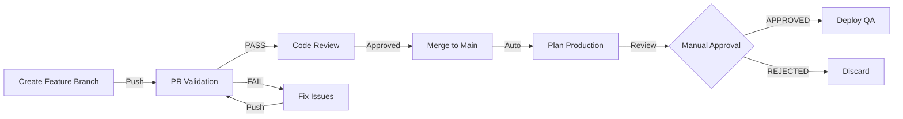
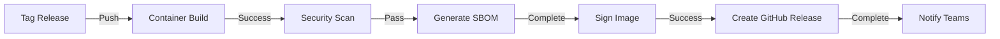
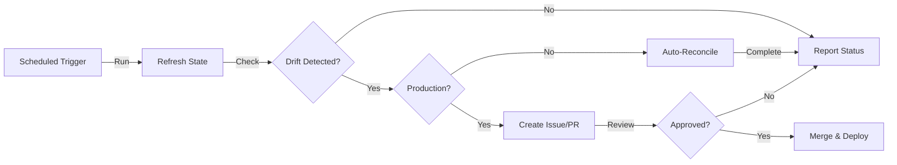

# Pipeline Architecture and Design Patterns

## System Architecture

### Data Flow

```
┌──────────────────────────────────────────────────────────────┐
│                         Git Repository                        │
│  ┌──────────────────────────────────────────────────────────┐ │
│  │  - terraform/        (Infrastructure code)              │ │
│  │  - kubernetes/       (K8s manifests)                    │ │
│  │  - scripts/          (Automation scripts)               │ │
│  │  - build/            (Container images)                 │ │
│  │  - policies/         (OPA policies)                     │ │
│  └──────────────────────────────────────────────────────────┘ │
└────────┬──────────────────────────────────────────────────────┘
         │
         ├─────────────────────┬──────────────────────┐
         │                     │                      │
         ▼                     ▼                      ▼
    ┌─────────────┐      ┌──────────────┐      ┌──────────────┐
    │   GitHub    │      │    GitLab    │      │  Webhooks    │
    │   Actions   │      │      CI      │      │              │
    └──────┬──────┘      └──────┬───────┘      └──────┬───────┘
           │                    │                     │
           └────────┬───────────┴─────────┬───────────┘
                    │                     │
         ┌──────────▼──────────┐ ┌────────▼──────────┐
         │  Validation Stage   │ │  Scanning Stage   │
         │  ────────────────   │ │  ───────────────  │
         │  Lint               │ │  Security         │
         │  Format             │ │  Compliance       │
         │  Syntax             │ │  Dependencies     │
         │  Structure          │ │  Cost             │
         └──────────┬──────────┘ └────────┬──────────┘
                    │                     │
         ┌──────────▼─────────────────────▼───────────┐
         │        Planning Stage                      │
         │        ──────────────────                  │
         │  terraform plan                            │
         │  Generate impact analysis                  │
         │  Store in artifacts                        │
         │  Comment on PR/MR                          │
         └──────────┬──────────────────────────────────┘
                    │
         ┌──────────▼──────────────────────────┐
         │  Approval Gates                      │
         │  ────────────────                    │
         │  Manual review                       │
         │  CODEOWNERS approval (if configured) │
         │  Environment protection rules        │
         └──────────┬──────────────────────────┘
                    │
         ┌──────────▼─────────────────────────┐
         │  Deployment Stage                   │
         │  ──────────────────                 │
         │  terraform apply                    │
         │  Update infrastructure              │
         │  Sync Kubernetes manifests          │
         │  Deploy containers                  │
         └──────────┬─────────────────────────┘
                    │
         ┌──────────▼──────────────────────┐
         │  Verification Stage              │
         │  ────────────────────            │
         │  Health checks                   │
         │  Smoke tests                     │
         │  ArgoCD sync verification        │
         │  Endpoint validation             │
         └──────────┬──────────────────────┘
                    │
         ┌──────────▼──────────────────────┐
         │  Post-Deployment                 │
         │  ────────────────                │
         │  Notifications                   │
         │  Artifacts archival              │
         │  Metrics recording               │
         │  Compliance reporting            │
         └──────────────────────────────────┘
```

## Workflow Orchestration Patterns

### Pattern 1: Feature Branch Workflow



### Pattern 2: Release Workflow



### Pattern 3: Drift Detection & Remediation



## Job Dependencies and Parallelization

### GitHub Actions Dependency Graph

```
metadata
     
├─  lint-terraform ──  validate-terraform ──  plan-environments
│                             
│                   terraform-security-scan
│                             
└─  lint-kubernetes ─  test-scripts ────────────  quality-gate
      
     └─────────────────────────┘
```

### GitLab CI DAG Pipeline

```
Validate
├─ validate:format
├─ validate:terraform (parallel × 3)
├─ validate:kubernetes
└─ validate:python

Scan (parallel)
├─ scan:tfsec
├─ scan:checkov
├─ scan:kubernetes
└─ scan:kube-bench

Plan (depends on Validate & Scan)
├─ plan:sandbox
├─ plan:dev
└─ plan:qa

Deploy (depends on Plan)
├─ deploy:sandbox
├─ deploy:dev
├─ deploy:qa
└─ deploy:prod

Verify (depends on Deploy)
├─ verify:health-check
└─ verify:argocd

Cleanup (on-demand)
└─ destroy:sandbox
```

## Security Architecture

### Authentication & Authorization Layer

```
┌─────────────────────────────────────────┐
│  GitHub/GitLab Webhook Event            │
└────────────────┬────────────────────────┘
                 │
                 ▼
         ┌───────────────────┐
         │ Pipeline Trigger  │
         └────────┬──────────┘
                  │
          ┌───────▼────────┐
          │  OIDC Provider │
          │  ──────────── │
          │  Verify Token  │
          │  Issue STS     │
          │  Credentials   │
          └───────┬────────┘
                  │
         ┌────────▼───────┐
         │  AWS STS       │
         │  ──────────    │
         │  Assume Role   │
         │  Temporary     │
         │  Credentials   │
         └────────┬───────┘
                  │
         ┌────────▼──────────┐
         │  AWS Services    │
         │  ──────────────  │
         │  Terraform       │
         │  EKS             │
         │  ECR             │
         │  CloudWatch      │
         └───────────────────┘
```

### Secret Management Strategy

```
┌─────────────────────────────────────────┐
│     Secret Storage Options              │
├─────────────────────────────────────────┤
│                                         │
│  OIDC Tokens (GitHub/GitLab)           │
│    No secrets stored, only events      │
│    Assume AWS role via STS             │
│   Most secure, rotated automatically  │
│                                         │
│  GitHub/GitLab Secrets                  │
│    API keys, OAuth tokens              │
│    Encrypted at rest                   │
│   Only used when OIDC unavailable     │
│                                         │
│  AWS Secrets Manager                    │
│    Sensitive runtime secrets            │
│    Centralized management               │
│   Audit logging and rotation          │
│                                         │
│  .gitignore + local .env               │
│    Development-only secrets             │
│    Never committed                      │
│   Protected by file permissions       │
│                                         │
└─────────────────────────────────────────┘
```

## Scan Pipeline Chain

```
Source Code
     
    ├─  Static Analysis (SAST)
    │   ├─ TFLint (Terraform linting)
    │   ├─ tfsec (Terraform security)
    │   ├─ Checkov (Policy as code)
    │   └─ Bandit (Python security)
    │
    ├─  Dependency Analysis (SCA)
    │   ├─ Dependabot (Dependency vulnerabilities)
    │   ├─ Safety (Python dependencies)
    │   └─ Snyk (Multi-language)
    │
    ├─  Configuration Validation
    │   ├─ kubeconform (Kubernetes schemas)
    │   ├─ kubeval (Kubernetes validation)
    │   └─ Conftest (OPA policies)
    │
    └─  Artifact Scanning
        ├─ Trivy (Container images)
        ├─ kube-bench (Kubernetes hardening)
        └─ Syft (SBOM generation)
```

## Deployment Strategy Architecture

### Blue-Green Deployment Pattern

```
Current State (Blue)               New State (Green)
┌─────────────────────┐           ┌─────────────────────┐
│  EKS Cluster 1      │           │  EKS Cluster 2      │
│  ┌───────────────┐  │           │  ┌───────────────┐  │
│  │ App v1.0      │  │           │  │ App v2.0      │  │
│  │ Replicas: 3   │  │           │  │ Replicas: 3   │  │
│  │ Ready:       │  │           │  │ Ready:       │  │
│  └───────────────┘  │           │  └───────────────┘  │
└──────────┬──────────┘           └──────────┬──────────┘
           │ 100% traffic                    │ 0% traffic
           │ (Health checks PASS)            │ (Testing)
           │                                 │
           └────────────────┬────────────────┘
                            │
                    ┌───────▼────────┐
                    │  Load Balancer │
                    │  ──────────── │
                    │  Route traffic │
                    │  to active     │
                    │  cluster       │
                    └────────────────┘
```

### Canary Deployment Pattern

```
Initial State: 95% Old, 5% New
┌─────────────────────────────────┐
│         Load Balancer           │
│  Traffic: 95% | 5%              │
├─────────────┬───────────────────┤
│   App v1.0  │   App v2.0        │
│   3 pods    │   1 pod (canary)  │
│   Stable    │   Testing         │
└─────────────┴───────────────────┘
          Monitor metrics (5 min)
          Error rate < 1% ?
          Latency < 100ms ?
          Yes   Continue shift

Middle State: 50% Old, 50% New
┌─────────────────────────────────┐
│         Load Balancer           │
│  Traffic: 50% | 50%             │
├─────────────┬───────────────────┤
│   App v1.0  │   App v2.0        │
│   2 pods    │   2 pods          │
│   Stable    │   Validated       │
└─────────────┴───────────────────┘
          Monitor metrics (5 min)
          Full validation

Final State: 0% Old, 100% New
┌─────────────────────────────────┐
│         Load Balancer           │
│  Traffic: 0% | 100%             │
├─────────────┬───────────────────┤
│   Offline   │   App v2.0        │
│             │   3 pods          │
│             │   Stable          │
└─────────────┴───────────────────┘
```

## Cost Optimization Architecture

```
Pipeline Execution
     
    ├─  Resource Tagging
    │   └─ Cost allocation tags
    │      - Environment
    │      - Project
    │      - Owner
    │      - Cost center
    │
    ├─  Infracost Analysis
    │   └─ Pre-deployment cost estimation
    │      - Monthly cost projection
    │      - Delta from current
    │      - Resource-level breakdown
    │
    ├─  Cost Monitoring
    │   └─ Post-deployment tracking
    │      - Actual spend vs estimate
    │      - Anomaly detection
    │      - Optimization alerts
    │
    └─  Optimization Actions
        ├─ Right-sizing recommendations
        ├─ Reserved instance suggestions
        ├─ Spot instance opportunities
        └─ Unused resource cleanup
```

## Monitoring and Observability Integration

```
Deployment Pipeline
     
    ├─  Structured Logging
    │   ├─ JSON formatted output
    │   ├─ Correlation IDs
    │   └─ Log levels (DEBUG, INFO, WARN, ERROR)
    │
    ├─  Metrics Collection
    │   ├─ Build duration
    │   ├─ Deployment success rate
    │   ├─ Security scan findings
    │   └─ Cost metrics
    │
    ├─  Distributed Tracing
    │   ├─ Workflow execution trace
    │   ├─ Job duration breakdown
    │   ├─ Dependency chains
    │   └─ Error propagation
    │
    └─  Alerting & Notifications
        ├─ Slack/Teams messages
        ├─ PagerDuty incidents
        ├─ GitHub/GitLab issues
        └─ Email summaries
```

## Disaster Recovery Architecture

```
Primary Pipeline Failure
     
    ├─  Automatic Rollback
    │   ├─ Previous deployment snapshot
    │   ├─ Terraform state rollback
    │   ├─ Container image revert
    │   └─ DNS failover
    │
    ├─  Manual Intervention
    │   ├─ Issue creation with details
    │   ├─ Team notification
    │   ├─ Incident timeline
    │   └─ Remediation steps
    │
    └─  Post-Incident
        ├─ Root cause analysis
        ├─ Automation improvements
        ├─ Documentation updates
        └─ Team review
```

## References

- [CQRS Pattern](https://microservices.io/patterns/data/cqrs.html)
- [Blue-Green Deployment](https://martinfowler.com/bliki/BlueGreenDeployment.html)
- [Canary Deployment](https://martinfowler.com/bliki/CanaryRelease.html)
- [GitOps Guide](https://www.weave.works/blog/gitops-operations-by-pull-request/)
- [CI/CD Best Practices](https://cloud.google.com/solutions/continuous-delivery-practices)
