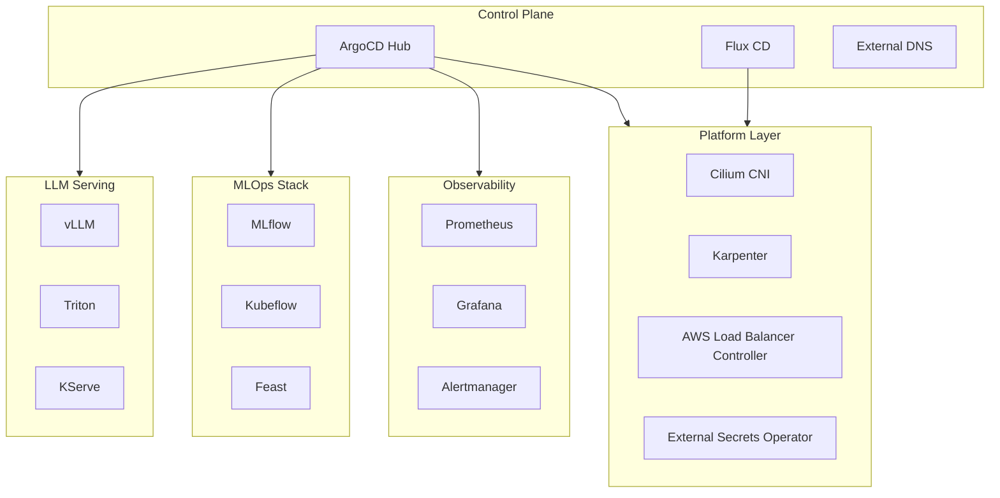
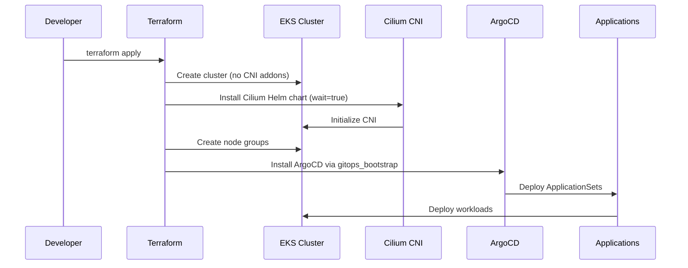
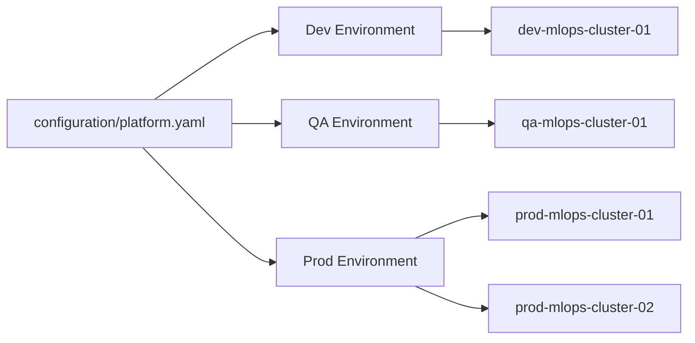
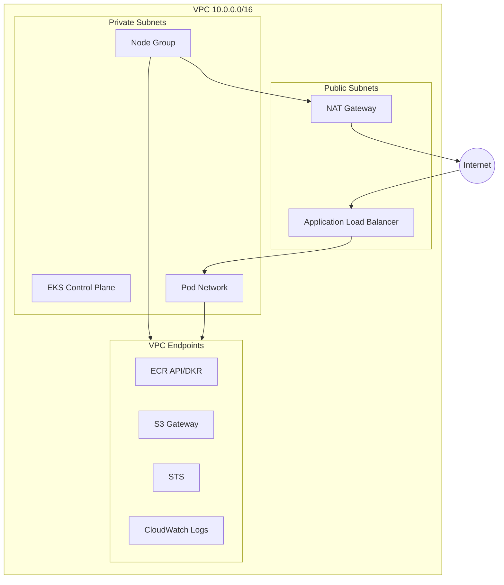

# ArgoEKS - Production-Grade EKS MLOps Platform

Kubernetes platform for MLOps and AI workloads on AWS EKS. Built with Terraform, ArgoCD, and full Cilium CNI with comprehensive observability and cost monitoring.

## Architecture



## Project Structure

```
argoeks/
├── terraform/              # Infrastructure as Code
│   ├── environments/       # Dev, QA, Prod configurations
│   │   ├── dev/
│   │   ├── qa/
│   │   └── prod/
│   └── modules/           # Reusable Terraform modules
│       ├── cluster_factory/
│       ├── networking/
│       └── gitops_bootstrap/
│
├── kubernetes/            # Kubernetes platform components
│   ├── platform/         # Helm charts and values
│   │   ├── argocd-hub/
│   │   ├── cilium/
│   │   ├── observability/
│   │   ├── kubeflow/
│   │   └── kserve/
│   ├── gitops/           # GitOps deployment manifests
│   │   ├── argocd/      # ArgoCD ApplicationSets
│   │   └── flux/        # Flux Kustomizations
│   └── policies/        # Kubernetes policies
│
├── configuration/         # YAML configuration files
│   ├── platform.yaml     # Multi-environment platform config
│   └── clusters/        # Cluster registry definitions
│
├── build/                # Build artifacts
│   ├── ecr/             # Container image configs
│   └── functions/       # Lambda functions
│
├── automation/           # CI/CD and scripts
│   └── scripts/         # Automation tooling
│
└── docs/                # Documentation
    ├── getting-started/
    ├── architecture/
    ├── runbooks/
    └── plans/
```

## Quick Start

### Prerequisites

- AWS Account with appropriate permissions
- Terraform >= 1.6
- kubectl >= 1.28
- AWS CLI v2

### Deploy Development Environment

```bash
# 1. Configure AWS credentials
export AWS_PROFILE=your-profile
# or
source .env

# 2. Initialize and deploy
cd terraform/environments/dev
terraform init
terraform plan
terraform apply

# 3. Configure kubectl
aws eks update-kubeconfig --name dev-mlops-cluster-01 --region us-east-1

# 4. Verify cluster
kubectl get nodes
kubectl get pods -n kube-system
```

### Access ArgoCD

```bash
# Port forward to ArgoCD server
kubectl port-forward svc/argocd-server -n argocd 8080:443

# Get admin password
kubectl get secret argocd-initial-admin-secret -n argocd -o jsonpath="{.data.password}" | base64 -d
```

Access at: https://localhost:8080

## Deployment Flow



## Core Components

### Infrastructure Layer

#### Full Cilium CNI (BYOCNI)
- No VPC CNI addon - pure Cilium implementation
- eBPF-based kube-proxy replacement
- Native routing with AWS ENI IPAM
- Maximum performance with no chaining overhead

**Key Features:**
```yaml
cni:
  chainingMode: none
  exclusive: true
kubeProxyReplacement: true
ipam:
  mode: eni
routingMode: native
```

#### Karpenter
- Just-in-time node provisioning
- Automatic rightsizing
- Spot instance support
- Multi-architecture (x86/ARM64)

#### AWS Load Balancer Controller
- ALB for HTTP/HTTPS ingress
- NLB for L4 services
- WAFv2 integration
- ACM certificate management

### GitOps Layer

#### ArgoCD
- Application deployment and lifecycle
- Multi-cluster management
- SSO integration (OIDC)
- RBAC with custom policies

#### Flux CD
- Infrastructure reconciliation
- Image automation
- Notification system
- Multi-tenancy support

### Observability

#### Prometheus Stack
- Metrics collection and storage
- Service discovery
- Recording rules
- Long-term storage with Thanos

#### Grafana
- Pre-configured dashboards
- Multi-cluster views
- Alerting integration

#### Alertmanager
- Alert routing and grouping
- Slack/PagerDuty integration
- Silence management

## Advanced Features

### Multi-Environment Support



### Private DNS

Each environment creates a private Route53 zone:
- `dev.eks.local`
- `qa.eks.local`
- `prod.eks.internal`

ExternalDNS automatically manages DNS records for LoadBalancer services.

### Security

#### Encryption
- EKS secrets encrypted with KMS
- S3 server-side encryption (SSE-KMS)
- RDS encryption at rest
- TLS in transit (ACM Private CA)

#### Identity and Access
- IRSA for all workloads
- No long-lived credentials
- OIDC for CI/CD
- SSO for ArgoCD/Grafana

#### Network Security
- Private API endpoint (prod)
- VPC endpoints for AWS services
- Network policies (Cilium)
- WAFv2 for public endpoints

## MLOps Stack

### Phase 2 Components

Deploy via ArgoCD ApplicationSets:

```bash
# MLflow for experiment tracking
kubectl apply -f kubernetes/gitops/argocd/applicationset-mlops-stack.yaml

# Kubeflow for ML pipelines
kubectl apply -f kubernetes/gitops/argocd/applicationset-kubeflow.yaml

# Feast for feature store
kubectl apply -f kubernetes/gitops/argocd/applicationset-feast.yaml
```

### Phase 3: LLM Serving

```bash
# vLLM for high-performance inference
kubectl apply -f kubernetes/gitops/argocd/applicationset-vllm.yaml

# Triton Inference Server
kubectl apply -f kubernetes/gitops/argocd/applicationset-triton.yaml

# KServe for model serving
kubectl apply -f kubernetes/gitops/argocd/applicationset-kserve.yaml
```

## Infrastructure Management

### Using Make

```bash
# Initialize environment
make init-env ENV=dev

# Plan changes
make plan-env ENV=dev

# Apply changes
make apply-env ENV=dev

# Destroy environment
make destroy-env ENV=dev

# Format Terraform files
make fmt

# Validate configuration
make validate ENV=dev
```

### Using Python CLI

```bash
# Install dependencies
pip install -r requirements-dev.txt

# Plan with preview
python automation/scripts/argoeks.py env plan --env dev --region us-east-1

# Apply with dry-run
python automation/scripts/argoeks.py --dry-run env apply --env dev

# View outputs
python automation/scripts/argoeks.py env output --env dev
```

### Environment Variables

Create `.env` file (use `.env.example` as template):

```bash
export AWS_PROFILE=your-profile
export AWS_REGION=us-east-1
export TF_VAR_private_domain=dev.eks.local
```

## Configuration

### Platform Configuration

Edit `configuration/platform.yaml` for environment-specific settings:

```yaml
envs:
  dev:
    alerts:
      emails: ["ops@example.com"]
      slack: {workspace_id: "", channel_id: ""}
    budgets:
      amount: 500
      currency: USD
      thresholds: [80, 95, 100]
    features:
      infrastructure:
        eks: true
        karpenter: true
      storage:
        s3: true
        redis: false
      security:
        waf: true
        guardduty: true
```

### Cluster Registry

Define clusters in `configuration/clusters/`:

```yaml
# configuration/clusters/dev.yaml
apiVersion: platform.example.io/v1alpha1
kind: ClusterRegistry
metadata:
  name: mlops-fleet-dev
spec:
  clusters:
    - name: dev-mlops-cluster-01
      region: us-east-1
      labels:
        cluster-type: mlops
        environment: dev
        hub: "true"
```

## Network Architecture



## Troubleshooting

### Check Cilium Status

```bash
kubectl exec -n kube-system ds/cilium -- cilium status
```

Expected output:
```
KubeProxyReplacement: True
IPAM: IPv4: ENI
CNI Chaining: none
```

### Verify Node Health

```bash
kubectl get nodes -o wide
kubectl describe node <node-name>
```

### Check ArgoCD Applications

```bash
kubectl get applications -n argocd
kubectl get applicationsets -n argocd
```

### Debug Pod Issues

```bash
# Check pod status
kubectl get pods -n <namespace>

# View logs
kubectl logs -f <pod-name> -n <namespace>

# Describe pod
kubectl describe pod <pod-name> -n <namespace>

# Network connectivity test
kubectl run netshoot --rm -it --image=nicolaka/netshoot -- bash
```

## Cost Optimization

### Development
- Use Spot instances with Karpenter
- Scale down non-production environments
- Use t3.large nodes (2 vCPU, 8GB RAM)
- Enable cluster autoscaling

### Production
- Right-size instance types
- Use Savings Plans or Reserved Instances
- Enable S3 lifecycle policies
- Use CloudWatch cost anomaly detection

### Budget Alerts

Configured in `configuration/platform.yaml`:

```yaml
budgets:
  amount: 10000
  currency: USD
  thresholds: [70, 85, 95, 100]
  billing_alarm_threshold: 9000
```

## Compliance

### PCI-DSS
- See `docs/PCI-DSS-Mapping.md`
- Encryption at rest and in transit
- Network segmentation
- Audit logging with CloudTrail
- Access control with RBAC

### SOC 2
- Centralized logging
- Security monitoring with GuardDuty
- Backup and disaster recovery
- Change management via GitOps

## CI/CD Integration

### GitHub Actions

Workflows in `.github/workflows/`:
- `ci.yml` - Terraform validation on PR
- `fleet-apply.yml` - Environment deployment
- `pr-sandbox.yml` - Ephemeral test environments

### GitLab CI

See `.gitlab-ci.yml` for GitLab pipeline configuration.

## Support and Documentation

- **Quick Start**: [docs/getting-started/quickstart.md](docs/getting-started/quickstart.md)
- **Architecture**: [docs/architecture/](docs/architecture/)
- **Runbooks**: [docs/runbooks/](docs/runbooks/)
- **Plans**: [docs/plans/](docs/plans/)

## Contributing

1. Create feature branch from `main`
2. Make changes with clear commit messages
3. Run `make fmt` and `make validate`
4. Open pull request with description
5. Wait for CI checks to pass

## License

Proprietary - Internal use only

## Maintainers

Platform Engineering Team
